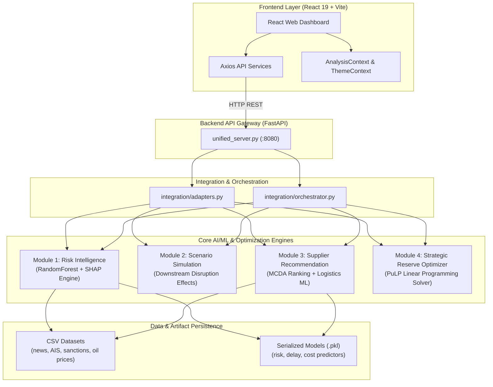

<div align="center">

  

  # Supply Chain Risk & Strategic Petroleum Reserve (SPR) Resilience Platform

  **AI-driven risk intelligence, disruption scenario simulation, alternative supplier recommendation, and strategic reserve optimization.**

  An end-to-end platform for energy supply chain risk management. Built with FastAPI, Scikit-learn, PuLP, and React.

  [](LICENSE)
  [](https://github.com/Pratik8035/HackthonProject/stargazers)
  [](https://github.com/Pratik8035/HackthonProject/network/members)
  [](https://github.com/Pratik8035/HackthonProject/issues)
  [](https://github.com/Pratik8035/HackthonProject/commits/main)
  [](CONTRIBUTING.md)

</div>

---

## Table of Contents

- [About](#about)
- [Features](#features)
- [Tech Stack](#tech-stack)
- [Architecture](#architecture)
- [Getting Started](#getting-started)
  - [Prerequisites](#prerequisites)
  - [Installation](#installation)
- [Environment Variables](#environment-variables)
- [Usage](#usage)
- [Project Structure](#project-structure)
- [Screenshots](#screenshots)
- [API Documentation](#api-documentation)
- [Roadmap](#roadmap)
- [Contributing](#contributing)
- [License](#license)
- [Authors](#authors)
- [Acknowledgements](#acknowledgements)
- [Support](#support)

---

## About

Global energy supply chains face severe vulnerabilities from geopolitical friction, maritime chokepoint blockades, regulatory sanctions, and extreme weather events. Legacy supply chain management systems lack real-time predictive risk capabilities and automated strategic mitigation.

This platform bridges that gap by combining machine learning risk intelligence, SHAP explainability, multi-criteria alternative supplier ranking, and Linear Programming (PuLP) for Strategic Petroleum Reserve (SPR) drawdown and inventory replenishment optimization.

---

## Features

- [x] **Live Risk Intelligence Engine**: ML classification of multi-stream risk data (news, AIS maritime signals, sanctions, commodity pricing).
- [x] **SHAP Explainability**: Dynamic feature attribution and natural language reason generation for risk scores.
- [x] **Disruption Scenario Simulation**: Active scenario prediction and downstream delay/cost impact forecasting.
- [x] **Alternative Supplier Recommendation**: Multi-criteria decision analysis (MCDA) for supplier risk assessment and ranking.
- [x] **Logistics & Route Optimization**: Maritime routing, transit day calculation, and shipping cost predictions.
- [x] **Strategic Reserve Optimizer**: PuLP linear programming solver for multi-period SPR drawdown schedules.
- [x] **Unified Orchestration Pipeline**: Automated API endpoint (`/api/v1/orchestrate`) connecting risk intelligence directly to SPR decisioning.
- [x] **Interactive Dashboard**: Modern executive UI featuring interactive Leaflet maps, Recharts analytics, and dark/light themes.
- [x] **PDF Report Generation**: One-click downloadable executive summary reports.

---

## Tech Stack

| Category | Technology | Source File |
|---|---|---|
| **Frontend Framework** | React 19, Vite | [`Frontend/package.json`](Frontend/package.json) |
| **Routing & State** | React Router DOM v7, React Context API | [`Frontend/package.json`](Frontend/package.json) |
| **UI Components & Styling** | Bootstrap 5, Framer Motion, React Icons | [`Frontend/package.json`](Frontend/package.json) |
| **Data Visualization** | Recharts, Leaflet, React Leaflet | [`Frontend/package.json`](Frontend/package.json) |
| **Report Generation** | jsPDF, jsPDF AutoTable | [`Frontend/package.json`](Frontend/package.json) |
| **Backend Gateway** | Python 3.10+, FastAPI, Uvicorn, Pydantic | [`Backend/HackthonProject/requirements_integrated.txt`](Backend/HackthonProject/requirements_integrated.txt) |
| **Machine Learning** | Scikit-learn, SHAP, Pandas, NumPy, SciPy | [`Backend/HackthonProject/requirements_integrated.txt`](Backend/HackthonProject/requirements_integrated.txt) |
| **Optimization Solver** | PuLP (Linear Programming Solver) | [`Backend/HackthonProject/requirements_integrated.txt`](Backend/HackthonProject/requirements_integrated.txt) |
| **Data Storage** | CSV File System Datasets | [`Backend/HackthonProject/datasets/`](Backend/HackthonProject/datasets/) |

---

## Architecture



---

## Getting Started

### Prerequisites

- **Python**: `3.10` or higher
- **Node.js**: `v18` or higher and `npm`

---

### Installation

#### 1. Clone the Repository

```bash
git clone https://github.com/Pratik8035/HackthonProject.git
cd HackthonProject
```

#### 2. Backend Setup

```bash
cd Backend/HackthonProject
pip install -r requirements_integrated.txt
python unified_server.py
```

*The FastAPI backend starts at `http://127.0.0.1:8080`. API documentation is available at `http://127.0.0.1:8080/docs`.*

#### 3. Frontend Setup

In a separate terminal window:

```bash
cd Frontend
npm install
npm run dev
```

*Access the interactive dashboard at `http://localhost:5173`.*

---

## Environment Variables

Create or update `.env` in the `Frontend` directory (see [`Frontend/.env`](Frontend/.env)):

```env
# Frontend API Base URL Configuration
VITE_API_BASE_URL=http://127.0.0.1:8080
```

---

## Usage

1. **Monitor Live Risk**: Navigate to **Live Risk Intelligence** to trigger real-time ML risk evaluations and view SHAP attribution factors.
2. **Simulate Disruption Scenarios**: Select active disruption scenarios (e.g., Strait Blockade, Extreme Weather) to analyze downstream cost and delay impacts.
3. **Evaluate Suppliers**: Use **Alternative Suppliers** to assess current supplier vulnerability and rank safer global alternatives.
4. **Optimize Strategic Reserves**: Run the **SPR Optimizer** to solve optimal daily drawdown rates, refinery supply routing, and inventory replenishment.
5. **Run End-to-End Orchestration**: Execute the full pipeline on **Integrated Analysis** to produce a complete risk-to-mitigation plan and generate PDF reports.

---

## Project Structure

```text
HackthonProject/
├── Backend/
│   └── HackthonProject/
│       ├── Alternative_Supplier_Module/   # Supplier ranking & route optimization
│       ├── Scenario_Module/               # Disruption scenario modeling
│       ├── StrategicReserveOptimizer/     # PuLP optimization solver & data scripts
│       ├── datasets/                      # Raw and processed CSV datasets
│       ├── models/                        # Pre-trained ML model binaries (.pkl)
│       ├── integration/                   # Orchestrator, adapters, and Pydantic models
│       ├── scripts/                       # Feature engineering & training scripts
│       ├── unified_server.py              # FastAPI application server
│       └── requirements_integrated.txt    # Python dependencies
├── Frontend/
│   ├── public/                            # Static SVG icons and favicon
│   ├── src/
│   │   ├── assets/                        # Images (hero.png) and vector graphics
│   │   ├── components/                    # Sidebar, TopNavbar, KPICard, ErrorBoundary
│   │   ├── contexts/                      # AnalysisContext and ThemeContext
│   │   ├── layouts/                       # MainLayout wrapper
│   │   ├── pages/                         # Dashboard, LiveRisk, AlternativeSupplier, etc.
│   │   ├── services/                      # Axios API service clients
│   │   ├── styles/                        # CSS stylesheets
│   │   ├── App.jsx                        # React application routes
│   │   └── main.jsx                       # Entry point
│   ├── .env                               # Environment configuration
│   ├── package.json                       # Dependencies and build scripts
│   └── vite.config.js                     # Vite configuration & API proxy
├── CONTRIBUTING.md                        # Contribution guidelines
├── LICENSE                                # MIT License file
└── README.md                              # Project documentation
```

---

## Screenshots

<!-- TODO: Add live UI screenshots when deployed to production -->
<div align="center">

| Platform Hero / Logo | Executive Dashboard Overview |
|:---:|:---:|
|  | *<!-- TODO: Add dashboard.png screenshot -->*<br/>`[Dashboard Screenshot Placeholder]` |

| Alternative Supplier Ranking | Strategic Reserve Optimizer |
|:---:|:---:|
| *<!-- TODO: Add supplier.png screenshot -->*<br/>`[Supplier Analysis Screenshot Placeholder]` | *<!-- TODO: Add spr.png screenshot -->*<br/>`[SPR Optimizer Screenshot Placeholder]` |

</div>

---

## API Documentation

The FastAPI backend exposes the following endpoints (available interactively at `http://127.0.0.1:8080/docs`):

### System
- `GET /` — Root health check and API status.

### Module 1: Risk Intelligence
- `GET /api/v1/risk/run` — Triggers daily ML risk assessment and SHAP reason engine.

### Module 2: Scenario Simulation
- `GET /api/v1/scenario/list` — Predicts active disruption scenarios weighted by risk.
- `POST /api/v1/scenario/effects` — Calculates downstream delay, cost, and price inflation effects.

### Module 3: Alternative Supplier Recommendation
- `GET /api/v1/supplier/current` — Retrieves current supplier database.
- `POST /api/v1/supplier/recommend` — Ranks alternative suppliers based on risk score.
- `POST /api/v1/supplier/route` — Computes optimized transit distance and transit days.
- `POST /api/v1/supplier/delay` — Predicts shipping delays using Random Forest Regressors.
- `POST /api/v1/supplier/cost` — Predicts total transportation and logistics costs.
- `POST /api/v1/supplier/complete-analysis` — Full multi-module supplier recommendation pipeline.

### Module 4: Strategic Petroleum Reserve Optimizer
- `POST /api/v1/optimize` — Solves multi-period daily SPR release and replenishment schedules via PuLP.

### Cohesive End-to-End Orchestrator
- `POST /api/v1/orchestrate` — Executes cohesive pipeline linking risk intelligence to SPR optimization.

---

## Roadmap

- [x] Live ML Risk Assessment & SHAP Reason Generation
- [x] Scenario Disruption Downstream Impact Forecasting
- [x] Alternative Supplier MCDA Ranking & Route Predictors
- [x] PuLP Linear Programming SPR Optimizer
- [x] End-to-End Orchestration Gateway (`/api/v1/orchestrate`)
- [x] Responsive React Executive Dashboard with PDF Exports
- [ ] Docker & Docker Compose containerized deployment
- [ ] Real-time WebSocket AIS Vessel Stream Integration
- [ ] Role-Based Access Control (RBAC) & OAuth2 Authentication

---

## Contributing

Contributions are welcome! Please review [`CONTRIBUTING.md`](CONTRIBUTING.md) for details on how to fork, develop, and submit pull requests.

---

## License

Distributed under the MIT License. See [`LICENSE`](LICENSE) for full details.

---

## Authors

| Name | Role | GitHub |
|---|---|---|
| **Pratik** | Lead Maintainer | [@Pratik8035](https://github.com/Pratik8035) |

---

## Acknowledgements

- Scikit-learn & SHAP open-source communities
- PuLP Linear Programming Library
- React & Vite ecosystem
- Leaflet & OpenStreetMap contributors

---

## Support

For questions, feature requests, or bug reports, please open an issue on GitHub at [GitHub Issues](https://github.com/Pratik8035/HackthonProject/issues).

---

<div align="center">
  If you found this project useful, consider giving it a ⭐!
</div>
