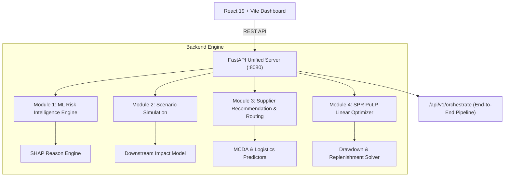

<div align="center">

  

  # Supply Chain Risk & SPR Resilience Platform

  **AI-driven risk intelligence, disruption scenario simulation, alternative supplier recommendation, and strategic reserve optimization.**

  An end-to-end platform for energy supply chain risk management. Built with FastAPI, Scikit-learn, PuLP, and React.

  [](LICENSE)
  [](https://github.com/Pratik8035/HackthonProject/stargazers)
  [](https://github.com/Pratik8035/HackthonProject/network/members)
  [](https://github.com/Pratik8035/HackthonProject/issues)
  [](https://github.com/Pratik8035/HackthonProject/commits/main)
  [](CONTRIBUTING.md)

</div>

---

## Table of Contents

- [About](#about)
- [Features](#features)
- [Tech Stack](#tech-stack)
- [Architecture](#architecture)
- [Getting Started](#getting-started)
  - [Prerequisites](#prerequisites)
  - [Installation](#installation)
- [Environment Variables](#environment-variables)
- [Usage](#usage)
- [Project Structure](#project-structure)
- [Screenshots](#screenshots)
- [API Documentation](#api-documentation)
- [Roadmap](#roadmap)
- [Contributing](#contributing)
- [License](#license)
- [Authors](#authors)
- [Acknowledgements](#acknowledgements)
- [Support](#support)

---

## About

Global energy supply chains face severe vulnerabilities from geopolitical friction, maritime chokepoint blockades, regulatory sanctions, and extreme weather events. Legacy supply chain management systems lack real-time predictive risk capabilities and automated strategic mitigation.

This platform bridges that gap by combining machine learning risk intelligence, SHAP explainability, multi-criteria alternative supplier ranking, and Linear Programming (PuLP) for Strategic Petroleum Reserve (SPR) drawdown and inventory replenishment optimization.

---

## Features

- [x] **Live Risk Intelligence Engine**: ML classification of multi-stream risk data (news, AIS maritime signals, sanctions, commodity pricing).
- [x] **SHAP Explainability**: Dynamic feature attribution and natural language reason generation for risk scores.
- [x] **Disruption Scenario Simulation**: Active scenario prediction and downstream delay/cost impact forecasting.
- [x] **Alternative Supplier Recommendation**: Multi-criteria decision analysis (MCDA) for supplier risk assessment and ranking.
- [x] **Logistics & Route Optimization**: Maritime routing, transit day calculation, and shipping cost predictions.
- [x] **Strategic Reserve Optimizer**: PuLP linear programming solver for multi-period SPR drawdown schedules.
- [x] **Unified Orchestration Pipeline**: Automated API endpoint (`/api/v1/orchestrate`) connecting risk intelligence directly to SPR decisioning.
- [x] **Interactive Dashboard**: Modern executive UI featuring interactive Leaflet maps, Recharts analytics, and dark/light themes.
- [x] **PDF Report Generation**: One-click downloadable executive summary reports.

---

## Tech Stack

| Category | Technology |
|---|---|
| **Frontend** | React 19, Vite, Bootstrap 5, Framer Motion |
| **Data Visualization** | Recharts, Leaflet, React Leaflet |
| **Backend API** | Python 3.10+, FastAPI, Uvicorn, Pydantic |
| **Machine Learning** | Scikit-learn, SHAP, Pandas, NumPy |
| **Optimization** | PuLP (Linear Programming Solver) |
| **Export Utilities** | jsPDF, html2canvas |

---

## Architecture



---

## Getting Started

### Prerequisites

- **Python**: `3.10` or higher
- **Node.js**: `v18` or higher and `npm`

---

### Installation

#### 1. Clone the Repository

```bash
git clone https://github.com/Pratik8035/HackthonProject.git
cd HackthonProject
```

#### 2. Backend Setup

```bash
cd Backend/HackthonProject
pip install -r requirements_integrated.txt
python unified_server.py
```

*The FastAPI backend will start on `http://127.0.0.1:8080`.*

#### 3. Frontend Setup

In a new terminal window:

```bash
cd Frontend
npm install
npm run dev
```

*Access the dashboard at `http://localhost:5173`.*

---

## Environment Variables

Copy `.env.example` or create a `.env` file inside the `Frontend` directory:

```env
# Frontend API Base URL
VITE_API_BASE_URL=http://127.0.0.1:8080
```

---

## Usage

1. **Monitor Live Risk**: Navigate to **Live Risk Intelligence** to trigger real-time ML risk evaluations and view SHAP attribution factors.
2. **Simulate Disruption Scenarios**: Select active disruption scenarios (e.g., Strait Blockade, Extreme Weather) to analyze downstream cost and delay impacts.
3. **Evaluate Suppliers**: Use **Alternative Suppliers** to assess current supplier vulnerability and rank safer global alternatives.
4. **Optimize Strategic Reserves**: Run the **SPR Optimizer** to solve optimal daily drawdown rates, refinery supply routing, and inventory replenishment.
5. **Run End-to-End Orchestration**: Execute the full pipeline on **Integrated Analysis** to produce a complete risk-to-mitigation plan and generate PDF reports.

---

## Project Structure

```text
HackthonProject/
├── Backend/
│   └── HackthonProject/
│       ├── Alternative_Supplier_Module/   # Supplier ranking & route optimization
│       ├── Scenario_Module/               # Disruption scenario modeling
│       ├── StrategicReserveOptimizer/     # PuLP optimization solver
│       ├── datasets/                      # Raw and processed CSV datasets
│       ├── models/                        # Pre-trained ML model binaries (.pkl)
│       ├── integration/                   # Orchestrator, adapters, and schemas
│       ├── unified_server.py              # FastAPI server entry point
│       └── requirements_integrated.txt    # Python dependencies
└── Frontend/
    ├── src/
    │   ├── components/                    # Reusable UI components
    │   ├── contexts/                      # React State Contexts
    │   ├── pages/                         # Dashboard views & analytics
    │   └── services/                      # Axios API service integrations
    ├── .env                               # Environment variables
    ├── package.json                       # Dependencies & scripts
    └── vite.config.js                     # Vite build configuration
```

---

## Screenshots

<div align="center">

| Dashboard Overview | Scenario Impact Analysis |
|:---:|:---:|
|  |  |

| Alternative Supplier Ranking | Strategic Reserve Optimizer |
|:---:|:---:|
|  |  |

</div>

---

## API Documentation

The FastAPI backend automatically generates interactive OpenAPI documentation. When the backend server is running, explore endpoints at:

- **Swagger UI**: `http://127.0.0.1:8080/docs`
- **ReDoc**: `http://127.0.0.1:8080/redoc`

---

## Roadmap

- [x] Live ML Risk Assessment & SHAP Reason Generation
- [x] Scenario Disruption Downstream Impact Solver
- [x] Alternative Supplier MCDA & Logistics Routing
- [x] PuLP Linear Programming SPR Optimizer
- [x] End-to-End Pipeline Orchestration API
- [x] Responsive React Executive Dashboard
- [ ] Real-time WebSocket AIS Vessel Stream Integration
- [ ] Multi-region Cloud Deployment (AWS / GCP)
- [ ] Role-Based Access Control (RBAC) & OAuth2 Authentication

---

## Contributing

Contributions are welcome! Please follow these steps:

1. Fork the Repository
2. Create your Feature Branch (`git checkout -b feature/AmazingFeature`)
3. Commit your Changes (`git commit -m 'Add some AmazingFeature'`)
4. Push to the Branch (`git push origin feature/AmazingFeature`)
5. Open a Pull Request

---

## License

Distributed under the MIT License. See [`LICENSE`](LICENSE) for details.

---

## Authors

| Name | Role | GitHub |
|---|---|---|
| **Pratik** | Lead Developer | [@Pratik8035](https://github.com/Pratik8035) |

---

## Acknowledgements

- Scikit-learn & SHAP communities
- PuLP Linear Programming Library
- React & Vite ecosystem
- Leaflet & OpenStreetMap contributors

---

## Support

For questions, feature requests, or bug reports, please open an issue on GitHub or reach out via [GitHub Issues](https://github.com/Pratik8035/HackthonProject/issues).

---

<div align="center">
  If you found this project useful, consider giving it a ⭐!
</div>
